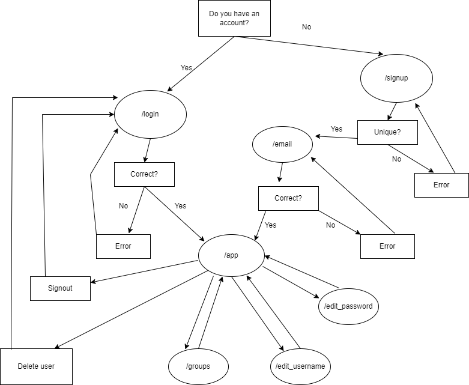

# Messanger App

---

### Table of Contents

* About
* Task Management
* Implemented Functionality
* Technical Overview
* User Guide
* Program Flow Diagram
* External Resources Used

---

### About

Messanger App is a erb-based messaging application created as a University of Dayton computer science capstone project by Garrett Weaver, Kaiden Kaiser, Thomas Woodrich, and Zak Honsaker.

Our app is called Messanger App because we made a typo when initializing the database and decided not to change it. But it also announces our greater purpose: to be a respite from the angry, hyperbolic, clickbait world of social media.

### Task Management

Our work was tracked on our [Trello board](https://trello.com/b/PrgpVolO).

### Requirements

See [Requirements.md](docs/Requirements.md).

### Implemented Functionality

* Create account
  
  * Creating account with the same name as an existing account is blocked

* Delete account

* Log in

* Log out

* Edit username

* Edit password

* Visit restricted page when logged in

* Unable to visit restricted page when logged out

* Password hashing and salting

* Custom CSS styling

* Cool smiley logo

---

### Technical Overview

This project uses the following tech stack:

* Express for the Node.JS-based backend

* Multer and body-parser for handling form data

* MongoDB (via Mongoose) for database and data schemas

* Pug for writing HTML

* Raw CSS (for now) for frontend styling

* Cookie-parser for, uh, parsing cookies (tracking login status)

* sha256 library for password hashing

At this stage of the project, there aren't many "design decisions" made, per se. Everything has tracked closely with the examples shown in class. One exception is our password hashing implementation. We decided to wrap all relevant functionality in its own password.js file, accessible through exported functions.

---

### User Guide

The Messanger App journey begins at the signup screen. Here, you must enter a username and password. (Usernames must be unique among all users - you will be warned if yours is a duplicate.) 

This will redirect you to the **protected page**. One day, you will be able to send messages here; but for now, you can log out, delete your account, or change your username and password. Note that trying to access the protected page before logging in will redirect you to the login page. This way, all of the app's existing functionality is accessible in one place.

---

### Program Flow Diagram

---

### External Resources Used

 So far, we have drawn exclusively from the slides shown in class.
