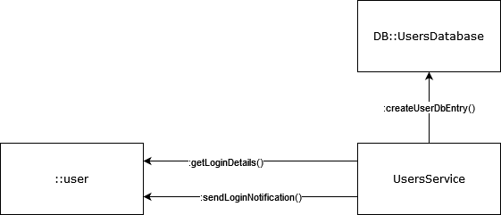
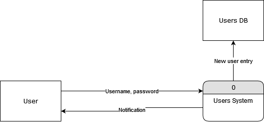
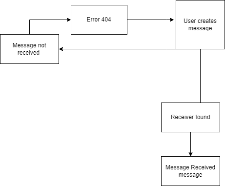

# Requirements

---

## Sprint 1

### Login

##### Use case description

User enters username and password, and the system creates a new account record with the provided information and a unique ID number

##### Sequence/communication diagrams

##### Activity/data flow diagrams

---

### Send a message

User writes a text file that is sent to a user

##### Sequence/communication diagrams

berbe

##### Activity/data flow diagrams

---

### Send a message to a single receiver

Use case description

bbrtb

##### Sequence/communication diagrams

berbe

##### Activity/data flow diagrams

ede

---

### Receive a message

Use case description

bbrtb

##### Sequence/communication diagrams

berbe

##### Activity/data flow diagrams

ede
